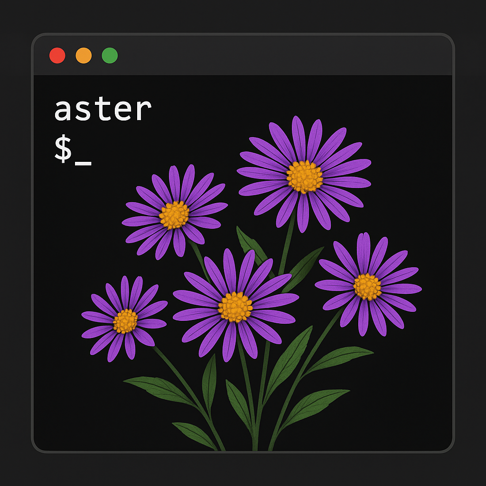

# Aster - AI coding agent

<p align="center">
  
</p>

## Stack

- TamboUI
- Azure OpenAI
- Spring Boot
- Spring AI
- Java 25

## Requirements

- Java 25
- Maven
- Azure OpenAI Deployment like gpt-5

## Installation

create *env.properties* file from *env.properties.example* and fill:

Azure OpenAI (required):

- `AZURE_OPENAI_API_KEY`
- `AZURE_OPENAI_ENDPOINT`
- `AZURE_OPENAI_DEPLOYMENT_NAME`

Or create env variables in your OS <br>
Mac/Linux:
```bash
export AZURE_OPENAI_API_KEY=<your-api-key>
export AZURE_OPENAI_ENDPOINT=<your-endpoint>
export AZURE_OPENAI_DEPLOYMENT_NAME=<your-deployment-name>
```

Windows

```powershell
$env:AZURE_OPENAI_API_KEY="<your-api-key>"
$env:AZURE_OPENAI_ENDPOINT="<your-endpoint>"
$env:AZURE_OPENAI_DEPLOYMENT_NAME="<your-deployment-name>"
$env:DATABASE_URL="<your-db-host>"
$env:DATABASE_NAME="<your-db-name>"
$env:DATABASE_USER="<your-db-user>"
$env:DATABASE_PASSWORD="<your-db-password>"
$env:DATABASE_PORT="<your-db-port>"
```

## Build

### Requirements

- Maven
- JDK
- optional - GraalVm JDK - for native

#### JVM

For running Aster on JVM run command:

``mvn package``

Then you can run the application with command:

``java -jar target/aster-0.0.1.jar``

#### Native

Aster has support for native image:

``
mvn -Pnative native:compile
``
Run binary with:
``
./target/aster
``

## MCP servers

MCP servers are configured in `~/.aster/mcp.json` (override the directory with the `ASTER_HOME`
environment variable). Manage them from the command line — these subcommands only touch the config file, they do not
start the TUI:

```bash
aster mcp add --transport http dependency-upgrader http://localhost:8080/mcp
aster mcp add --transport sse docs http://localhost:8080/sse
aster mcp list
aster mcp remove dependency-upgrader
```

`--transport` accepts `http` (streamable HTTP, the default) and `sse`. The URL is split into the server origin and its
endpoint:

```json
{
  "servers": [
    {
      "name": "dependency-upgrader",
      "url": "http://localhost:8080",
      "endpoint": "/mcp",
      "protocolType": "STREAMABLE_HTTP"
    }
  ]
}
```


